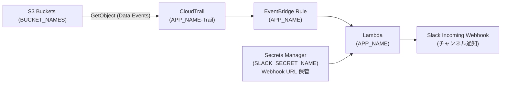

# [CDK] S3 の GetObject を CloudTrail Data Events で検知して Slack 通知する（既存 Trail は触らない）

> 監視したい S3 バケットで発生した **GetObject** を **CloudTrail の Data Events** で拾い、**EventBridge → Lambda** で整形して **Slack** に通知します。  
> 本スタックは **専用 CloudTrail** を自動作成し、**既存の組織/アカウント Trail には一切手を入れません**。

---

## できること / できないこと

- ✅ 対象バケットの **GetObject** を検知し Slack に通知  
- ✅ **IP/アクセスキー末尾/アカウントIDのマスク**や **👤/🤖 絵文字**を環境変数で切替  
- ✅ 複数バケット・複数チャンネル（スタックを分けて同居）  
- ✅ 既存の CloudTrail 設定を壊さない（**専用 Trail** 方式）

- ⛔ 既存の Trail に“追記”はしない（誤爆防止のため分離運用）

> ℹ️ **コスト注意**：CloudTrail **Data Events はイベント量課金**です。対象バケットは必要最小限にしてください。

---

## 前提

- AWS CLI v2 / Node.js 18+ / AWS CDK v2（`npm i -g aws-cdk`）
- Slack の **Incoming Webhook**（通知先チャンネル）
- 監視したい **S3 バケット**が存在
- 権限：CloudTrail / EventBridge / Lambda / Secrets Manager / CloudWatch Logs を作成できる

> 📝 本記事では **コード断片は掲載しません**（コマンドと図のみ）。コードは GitHub へ。

---

## クイックスタート（コマンドだけ）

> zsh の方は **同じ行にコメントを書かない**でください（`unset: #: invalid parameter name` になるため）。

```bash
# 1) 環境変数（必要に応じて書き換え）
export CDK_DEFAULT_REGION=ap-northeast-1
export APP_NAME='GetObjectMonitor-A'                  # Lambda名＝EventBridgeルール名
export BUCKET_NAMES='your-bucket-1 your-bucket-2'     # 監視バケット（スペース/カンマ/改行区切りOK）
export SLACK_SECRET_NAME='slack/webhook-getobject'    # Secrets Manager のシークレット名

# 2) Slack Webhook を Secrets Manager へ登録（初回のみ）
aws secretsmanager create-secret   --name "$SLACK_SECRET_NAME"   --secret-string '{"url":"https://hooks.slack.com/services/XXX/YYY/ZZZ"}'   --region "$CDK_DEFAULT_REGION"

# 3) CDK ブートストラップ（アカウント/リージョンで1回）
cdk bootstrap

# 4) デプロイ
cdk deploy --require-approval never
```

### 動作確認（すぐに通知を見たい）

```bash
# リソースの存在確認
aws lambda get-function --function-name "$APP_NAME" --region "$CDK_DEFAULT_REGION" --query 'Configuration.FunctionArn' --output text
aws events describe-rule --name "$APP_NAME" --region "$CDK_DEFAULT_REGION" --query 'State' --output text
aws cloudtrail describe-trails --region "$CDK_DEFAULT_REGION" --query "trailList[?Name=='${APP_NAME}-Trail'].Name" --output text

# Lambda 単体テスト（Slack疎通チェック）
cat > /tmp/evt.json <<'JSON'
{
  "version": "0",
  "detail-type": "AWS API Call via CloudTrail",
  "source": "aws.s3",
  "account": "000000000000",
  "time": "2025-01-01T00:00:00Z",
  "region": "ap-northeast-1",
  "detail": {
    "eventSource": "s3.amazonaws.com",
    "eventName": "GetObject",
    "sourceIPAddress": "1.2.3.4",
    "userAgent": "aws-cli/2.15.0 Python/3.11 botocore/2.14.0",
    "requestParameters": { "bucketName": "your-bucket-1", "key": "dummy.txt" },
    "userIdentity": { "type": "IAMUser", "accessKeyId": "ASIAXXXXX", "arn": "arn:aws:iam::123456789012:user/test" }
  }
}
JSON

aws lambda invoke --function-name "$APP_NAME"   --payload fileb:///tmp/evt.json   --region "$CDK_DEFAULT_REGION" /tmp/out.json >/dev/null

# 本番経路テスト（実オブジェクトで GetObject を1回起こす）
KEY=$(aws s3api list-objects-v2 --bucket your-bucket-1 --max-items 1   --query 'Contents[0].Key' --output text --region "$CDK_DEFAULT_REGION")
aws s3api get-object --bucket your-bucket-1 --key "$KEY" /dev/null   --region "$CDK_DEFAULT_REGION" >/dev/null 2>&1 || true

# 通知が来ない場合の直近ログ
aws logs tail /aws/lambda/$APP_NAME --region "$CDK_DEFAULT_REGION" --since 10m
```

---

## カスタマイズ（Lambda の環境変数で出し分け）

> デプロイ済みでも `update-function-configuration` で切り替え可能（再デプロイ不要、反映は数十秒）。

```bash
aws lambda update-function-configuration   --function-name "$APP_NAME"   --region "$CDK_DEFAULT_REGION"   --environment "Variables={
    SLACK_SECRET_NAME=$SLACK_SECRET_NAME,
    REGION=$CDK_DEFAULT_REGION,
    MASK_IP=true,                # IPv4: /24, IPv6: /64 に丸め表示
    MASK_ACCESS_KEY=true,        # アクセスキー末尾4桁のみ
    MASK_ACCOUNT_ID=true,        # アカウントIDを 12***3456 形式にマスク
    EMOJI_HUMAN=:inbox_tray:,    # 人間っぽいアクセスのヘッダー絵文字
    EMOJI_ROBOT=:robot_face:,    # 自動/タスクっぽいアクセスの絵文字
    TREAT_CLI_AS_HUMAN=false     # aws-cli/botocore を人扱いするなら true
  }"
```

- **誰がDLしたか**を重視：ユーザー/セッション名は表示、アカウントIDはマスク推奨  
- **公開範囲が広いチャンネル**ではマスク強め、**狭い社内チャンネル**では読みやすさ重視…など運用に合わせて

---

## 複数バケット / 複数チャンネル

- **バケット追加**：`BUCKET_NAMES` に追記して `cdk deploy`。専用 Trail の Data Events に自動反映。  
- **別チャンネルにも通知**：**別のシークレット名**＋**別の `APP_NAME`** で同居デプロイ。

```bash
# 例：2系統目（Bチャンネル）
export APP_NAME='GetObjectMonitor-B'
export SLACK_SECRET_NAME='slack/webhook-security'
cdk deploy --require-approval never
```

---

## アーキテクチャ図（Mermaid）



---

## リポジトリ構成（GitHub はこのままが楽）

```
s3-getobject-monitor-cdk/
├─ bin/                         # CDKエントリ（envを読む）
│   └─ s3-getobject-monitor-cdk.ts
├─ lib/                         # スタック定義（Trail/Rule/Lambda）
│   └─ s3-getobject-monitor-cdk-stack.ts
├─ lambda/                      # Slack通知ロジック（Webhook/マスク/絵文字）
│   └─ notify_app.py
├─ cdk.json
├─ package.json
├─ tsconfig.json
├─ .gitignore                   # .env, cdk.out など除外
└─ README.md
```

> **ベストプラクティス**：GitHub は上記構造を保ち、Qiita からは **図＋ツリー＋コマンド** に留めてリンクする。

---

## トラブルシュート（よくある）

- **通知が来ない（Lambda 単体もNG）**  
  → `aws secretsmanager get-secret-value --secret-id "$SLACK_SECRET_NAME"` で **Secret 名/URL** を確認  
- **Lambda 単体OKだが本番経路で来ない**  
  → `aws cloudtrail get-event-selectors --trail-name ${APP_NAME}-Trail` に対象バケットが入っているか  
  → `aws events describe-rule --name "$APP_NAME" --query State` が `ENABLED` か  
  → 直近ログ：`aws logs tail /aws/lambda/$APP_NAME --region "$CDK_DEFAULT_REGION" --since 10m`
- **`BUCKET_NAMES` 未設定エラー**  
  → `export BUCKET_NAMES='...'` を設定（スペース/カンマ区切りOK）
- **zsh の `unset: #: invalid parameter name`**  
  → **同じ行の末尾にコメントを書かない**（`unset VAR # comment` はNG）

---

## 片付け（削除）

```bash
cdk destroy
aws secretsmanager delete-secret --secret-id "$SLACK_SECRET_NAME"   --region "$CDK_DEFAULT_REGION" --force-delete-without-recovery
```

> CloudTrail ログ保存バケットにオブジェクトが残っていると削除失敗します。  
> その場合は `aws s3 rm s3://<trail-log-bucket> --recursive` で空にしてから再実行。

---

## 免責 / セキュリティ注意

- **Data Events のコスト**に注意。対象を最小限に。  
- 通知には「ユーザー/セッション名、UA、アクセスキー末尾」などが含まれます。**公開範囲に応じてマスク設定**を調整してください。  
- 監査要件に合わせて、イベント保存期間や通知チャンネルのアクセス制御もご検討を。

---

### 参考（次の一手）

- 別チャンネル・別環境向けには **スタックを複数**に分けると運用が楽  
- Webhook では送信者アイコンの切替が制限されるため、**本格的な見た目カスタム**が必要な場合は Slack Bot Token + `chat.postMessage` への移行を検討

---

## License
This project is licensed under the MIT License — see the [LICENSE](LICENSE) file for details.

---

⚠️ Note  
This software was created and released by the author as a **personal open-source project**.  
It is **not a deliverable or commissioned work** for any client or employer.

✅ Corporate/commercial use allowed  
You are free to use, modify, and integrate this software **within your company or for client work** under the terms of the MIT License. **No additional permission is required.**  
If you redistribute, please retain the copyright notice and the LICENSE file.

✅ 会社内・商用での利用について  
本ソフトウェアは **MIT ライセンスの範囲で、社内利用・商用利用・受託案件への組み込みも自由**に行えます。**追加の許諾は不要**です。  
再配布する場合は、著作権表示と LICENSE ファイルを残してください。
